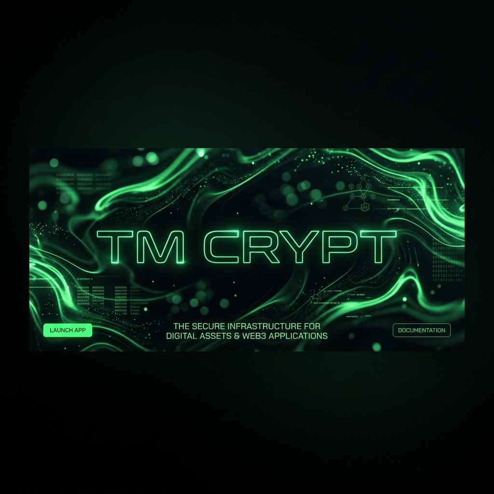

<p align="center">
  
</p>

# 📟 TM Crypt — Terminal-Grade Turing Machine Simulator

<div align="center">

[](https://github.com/vinod24256/TOC_CP)
[](https://github.com/vinod24256/TOC_CP)
[](https://github.com/vinod24256/TOC_CP)
[](https://github.com/vinod24256/TOC_CP)

</div>

---

## 🎭 The Vision

**TM Crypt** is a premium educational platform that bridges the gap between **High-End Product Design** and **Theoretical Computer Science**. It transforms the abstract concept of a Turing Machine into a tangible, cinematic experience, allowing students to "see" computation breathe as it secures modern communications.

### [🚀 View Live Site](https://vinod24256.github.io/TOC_CP/)

---

## 🌟 High-Fidelity Features

### 1. Cinematic Fluid Shader (`index.html`)
- **Domain-Warp Background**: A raw GLSL fragment shader simulating organic computation veins.
- **Scroll-Triggered Reveals**: Precise staggered animations that guide the user through Unit 5 theory.
- **Computation Strip**: A continuous tape runner visualising transition logic $\delta(q, \sigma)$ live.

### 2. Messaging SaaS Simulator (`app.html`)
- **WhatsApp Aesthetic**: Full-screen dark-teal interface with glassmorphic panels.
- **7-Tuple Logic**: A functional "Total Decider" TM that implements Caesar encryption $E(x) = (x + k) \pmod{26}$.
- **Analytics Suite**: Integrated Chart.js metrics and interactive D3.js state graphs.

### 3. Theory Deep-Dive (`learn.html`)
- **Formal Academic Rigor**: Detailed visualisations of the Church-Turing thesis, Instantaneous Descriptions (IDs), and the Halting Problem proof.
- **Interactive Methodology**: Visualizing logical contradictions to prove undecidability.

---

## 📐 Formal Academic Specifications

- **Machine Type**: 1-Tape Deterministic Turing Machine (DTM)
- **Complexity**: $O(n)$ Time | $O(n)$ Space
- **Formal Definition**: $M = (Q, \Sigma, \Gamma, \delta, q_0, q_{acc}, q_{rej})$
- **States (Q)**: $\{q_0, q_{upper}, q_{lower}, q_{skip}, q_{accept}\}$

---

## 🚀 Deployment & Installation

**TM Crypt** is built with zero dependencies, requiring only a modern browser.

1.  **Clone the Repository**:
    ```bash
    git clone https://github.com/vinod24256/TOC_CP.git
    ```
2.  **Run Locally**: Open `index.html` in any browser (we recommend using VS Code Live Server for the best shader performance).
3.  **One-Click Deployment**: Fully compatible with GitHub Pages.

---

## 🏷️ Credits
- **Developed by**: Vinod Katevarapu
- **Student ID**: S20240010256
- **Project**: Theory of Computation — Class Participation (Unit 5)

---
<p align="center">
  <i>"Computation is not just math; it is a cinematic sequence of discrete wonders."</i>
</p>
